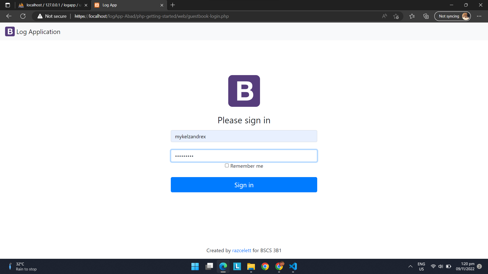
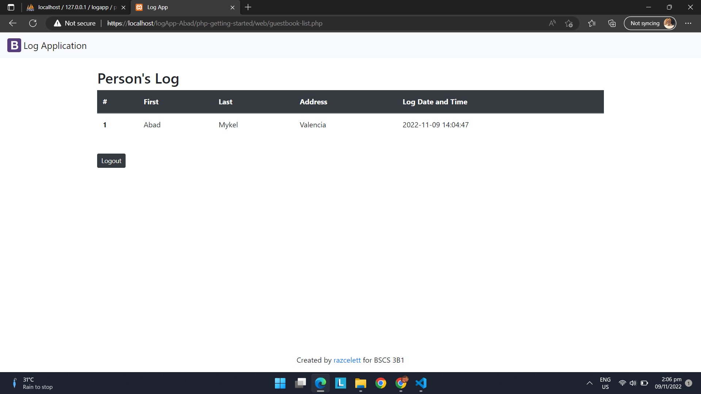
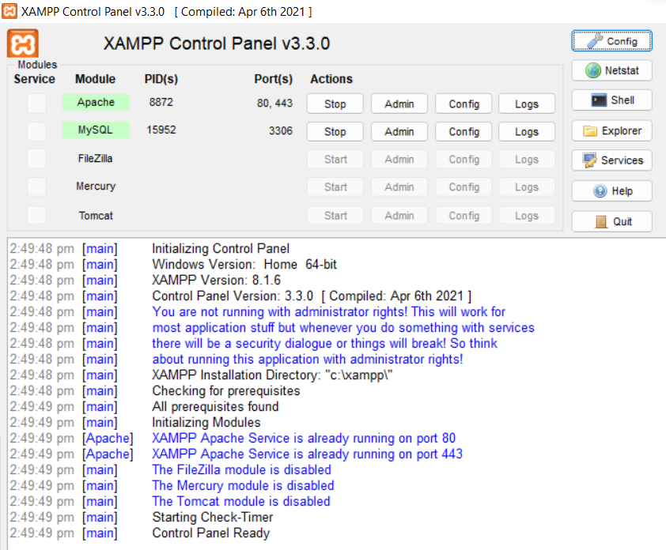
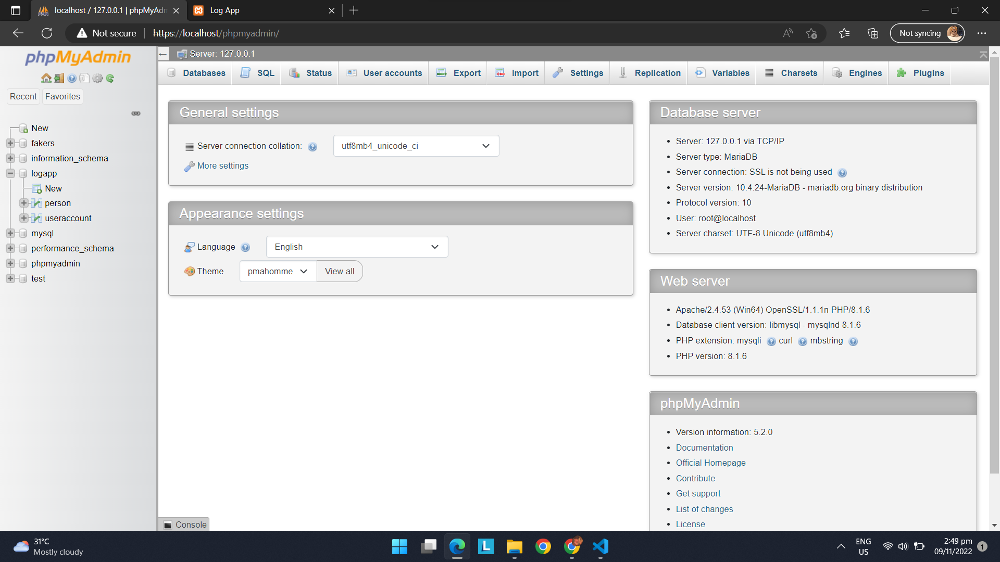
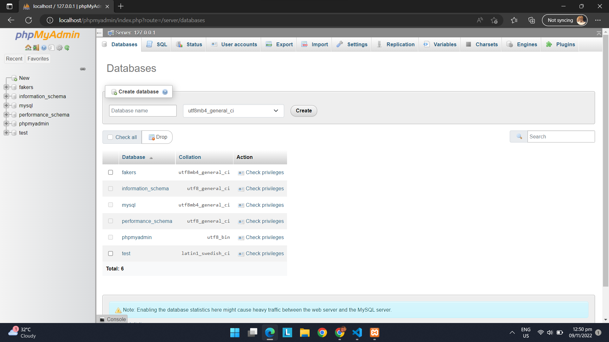

# logApp-Abad

<br />
<div align="center">

   <p align="center">
     </p>
  </a>

  <h1 align="center">COVID Contact Tracer</h1>

  <p align="center">
   This repository lets you keep track of your interactions with the assistance of this simple but valuable contact tracing app.
    <br />
    <br />
    <br />

  </p>
</div>

# About Contact Tracer :mask:

_Contact tracing helps to slow the spread of the disease by informing individuals that they might have been exposed to the coronavirus because they were in close contact with someone who tested positive for SARS-CoV-2, the virus that causes COVID-19. It's a public health strategy that's been used for years to combat communicable diseases._

> ## Features:

- It has a user interface that lets you log in to see the database for those who logged in first.
  The login page allows a user to gain access to an application by entering their username and password.

  [https://localhost/logApp-Abad/php-getting-started/web/guestbook-login.php](https://localhost/logApp-Abad/php-getting-started/web/guestbook-login.php)

<br></br>

- When the email and password is entered and when the submit button is clicked, the database of the people that logged in will appear.

  [https://localhost/logApp-Abad/php-getting-started/web/guestbook-list.php](https://localhost/logApp-Abad/php-getting-started/web/guestbook-login.php)



---

Contact tracing is a time-tested way to limit the spread of contagious diseases. Along with testing, contact tracing is a crucial method for slowing the spread of COVID-19. It's a basic tool of medical detective-work, aimed at keeping your family, friends and community members safe if you may have exposed them to the virus.

<br></br>

# Installation of phpMyAdmin :computer:

phpMyAdmin is a free software tool written in PHP, intended to handle the administration of MySQL over the Web. phpMyAdmin supports a wide range of operations on MySQL and MariaDB. Frequently used operations (managing databases, tables, columns, relations, indexes, users, permissions, etc) can be performed via the user interface, while you still have the ability to directly execute any SQL statement.

> ## Prerequisite

To set up the phpMyAdmin, installation of XAMPP is a must.

- XAMPP
  ```sh
  Install XAMPP
  ```
  - [XAMPP Downloader](https://www.apachefriends.org/) :arrow_left:

> ## Installation

_XAMPP is a free and open-source cross-platform web server solution stack package developed by Apache Friends, consisting mainly of the Apache HTTP Server, MariaDB database, and interpreters for scripts written in the PHP and Perl programming languages._

1. Download and install XAMPP

---

2. Start the Apache and MySQL in XAMPP Control Panel
   

---

3. Go to `phpMyAdmin`
   ```sh
   localhost/phpmyadmin/
   ```



---

4. Create your own `database`
   

   ```js
   http://localhost/phpmyadmin/index.php?route=/server/databases
   ```

---

<!-- USAGE EXAMPLES -->

<br></br>

# About the author :boy:

<p align="left">
     </p>

**Mykel Zandrex Abad** is the author of logApp-Abad, recordsapp-abad, php-fiesta-cookie, htmlcss-octo-couscous, legendary-garbanzo, and LabHigh-CC6, a Github repositories. Computer Science student by day, lover by night, He is currently getting his degree in bachelor of Science in Computer Science from Palawan State University. A Filipino native, he is a lover of basketball, coffee, dougnuts, and beaches, currently residing at Puerto Princesa City, Palawan.
You can visit his blog at (https://www.facebook.com/anatawa.bakadesu.790/)

<!-- CONTACT -->

> ## Contact :seedling:

Project Link: [https://github.com/xerdnaz/logApp-Abad.git](https://github.com/xerdnaz/logApp-Abad.git)

<br>

<!-- ACKNOWLEDGMENTS -->

> ## Acknowledgments

This endeavor would not have been possible without

- [Mykel Zandrex Abad ](https://github.com/xerdnaz)
- [GitHub Emoji Cheat Sheet](https://www.webpagefx.com/tools/emoji-cheat-sheet)
- [Google](https://www.google.com/)
